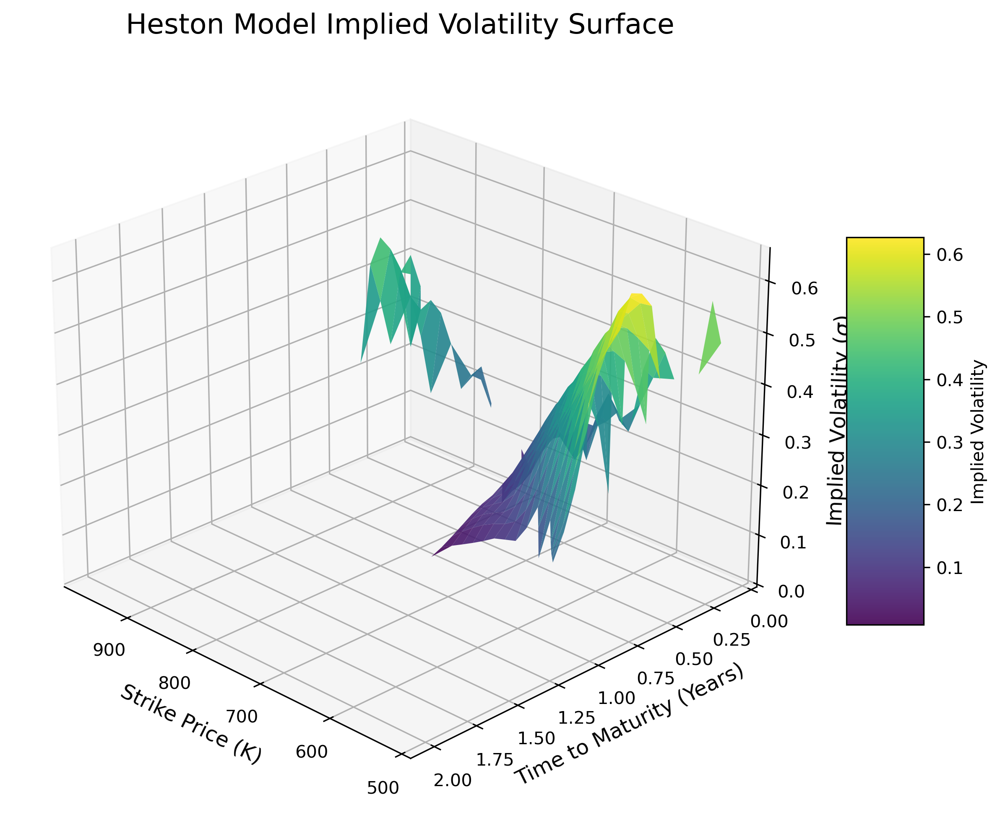

# Heston Stochastic Volatility Model Calibration

An end-to-end quantitative pipeline for fetching live market data, pricing European options via Fourier inversion, and calibrating the Heston stochastic volatility model to real S&P 500 (SPY) options using nonlinear least squares optimization.

## Overview

The Black-Scholes model assumes constant volatility, which empirically fails in post-1987 equity markets, producing a "Volatility Smile." The Heston model addresses this by treating variance as a Cox-Ingersoll-Ross (CIR) stochastic process.

This project implements the Heston model to capture the leverage effect (correlation between asset returns and variance) and calibrates it to live market data.

## The Mathematical Framework

Under the risk-neutral measure $\mathbb{Q}$, the asset price $S_t$ and its instantaneous variance $V_t$ follow the coupled Stochastic Differential Equations (SDEs):

$$dS_t = r S_t dt + \sqrt{V_t} S_t d\tilde{W}_t^S$$
$$dV_t = \kappa(\theta - V_t)dt + \sigma \sqrt{V_t} d\tilde{W}_t^V$$

Where the Brownian motions are correlated: $d\langle \tilde{W}^S, \tilde{W}^V \rangle_t = \rho dt$.

### Pricing via Fourier Inversion
Rather than solving the 2D PDE numerically (which is computationally expensive for calibration), this project utilizes the **Gil-Pelaez inversion theorem** and the **Albrecher (2007) formulation** of the characteristic function to guarantee numerical stability. 

The Call option price is calculated as:
$$C(S, K, \tau) = S \cdot P_1 - K e^{-r\tau} P_2$$
Where the probabilities $P_j$ are evaluated using numerical integration over the complex domain.

## Project Structure

* `data/` : Live SPY options chains pulled via `yfinance`.
* `notebooks/` :
  * `01_Data_Acquisition.ipynb`: Automates fetching, cleaning, and calculating time-to-maturity for SPY options.
  * `03_Fourier_Pricing.ipynb`: The core analytical pricing engine and the Levenberg-Marquardt optimization loop used to calibrate the parameters ($\kappa, \theta, \sigma, \rho, V_0$).

## Setup and Usage

1. Clone the repository.
2. Install dependencies: `pip install numpy scipy pandas matplotlib yfinance`
3. Run the Jupyter notebooks sequentially to fetch live data, calibrate the model, and generate the implied volatility surface plot.

## Technologies Used
* **Python**: Core algorithmic logic.
* **SciPy**: Complex numerical integration (`quad`) and Levenberg-Marquardt optimization (`least_squares`).
* **NumPy/Pandas**: Vectorized market data cleaning and filtering.
